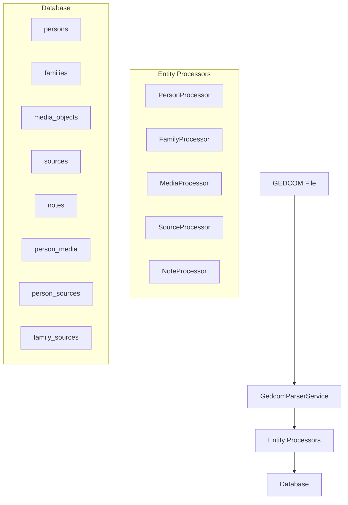

# Architecture technique - Import GEDCOM Complet

## 1. Vue d'ensemble

Cette architecture propose une solution complète pour importer l'intégralité des données GEDCOM dans JdGenea, en ajoutant les entités manquantes et en améliorant le parsing.

## 2. Architecture proposée



## 3. Modèles de données à ajouter

### 3.1 MediaObject
```php
#[ORM\Entity]
#[ORM\Table(name: 'media_objects')]
class MediaObject
{
    #[ORM\Id]
    #[ORM\Column(type: 'string', length: 36)]
    private string $id;
    
    #[ORM\Column(type: 'string', length: 255)]
    private string $fileName;
    
    #[ORM\Column(type: 'string', length: 255, nullable: true)]
    private ?string $title = null;
    
    #[ORM\Column(type: 'text', nullable: true)]
    private ?string $description = null;
    
    #[ORM\Column(type: 'string', length: 100)]
    private string $mediaType; // PHOTO, AUDIO, VIDEO, etc.
    
    #[ORM\Column(type: 'string', length: 32, nullable: true)]
    private ?string $gedcomId = null;
    
    #[ORM\Column(type: 'datetime_immutable')]
    private \DateTimeInterface $createdAt;
}
```

### 3.2 Source
```php
#[ORM\Entity]
#[ORM\Table(name: 'sources')]
class Source
{
    #[ORM\Id]
    #[ORM\Column(type: 'string', length: 36)]
    private string $id;
    
    #[ORM\Column(type: 'string', length: 255)]
    private string $title;
    
    #[ORM\Column(type: 'text', nullable: true)]
    private ?string $author = null;
    
    #[ORM\Column(type: 'text', nullable: true)]
    private ?string $publication = null;
    
    #[ORM\Column(type: 'text', nullable: true)]
    private ?string $text = null;
    
    #[ORM\Column(type: 'string', length: 32, nullable: true)]
    private ?string $gedcomId = null;
    
    #[ORM\Column(type: 'datetime_immutable')]
    private \DateTimeInterface $createdAt;
}
```

### 3.3 Note
```php
#[ORM\Entity]
#[ORM\Table(name: 'notes')]
class Note
{
    #[ORM\Id]
    #[ORM\Column(type: 'string', length: 36)]
    private string $id;
    
    #[ORM\Column(type: 'text')]
    private string $content;
    
    #[ORM\Column(type: 'string', length: 32, nullable: true)]
    private ?string $gedcomId = null;
    
    #[ORM\Column(type: 'datetime_immutable')
    private \DateTimeInterface $createdAt;
}
```

### 3.4 Tables de liaison
```php
// person_media (ManyToMany)
person_id | media_id | is_primary | gedcom_ref

// person_sources (ManyToMany)
person_id | source_id | event_type | gedcom_ref

// family_sources (ManyToMany)
family_id | source_id | event_type | gedcom_ref
```

## 4. Amélioration du GedcomService

### 4.1 Structure du nouveau parser
```php
class GedcomParserService
{
    private array $parsers = [];
    
    public function __construct()
    {
        $this->parsers = [
            'INDI' => new PersonParser(),
            'FAM' => new FamilyParser(),
            'OBJE' => new MediaParser(),
            'SOUR' => new SourceParser(),
            'NOTE' => new NoteParser(),
        ];
    }
    
    public function parse(string $content): array
    {
        $lines = $this->tokenize($content);
        $entities = $this->buildEntityTree($lines);
        return $this->processEntities($entities);
    }
    
    private function tokenize(string $content): array
    {
        // Parser amélioré avec gestion des niveaux
        $lines = [];
        foreach (preg_split('/\r?\n/', $content) as $line) {
            if (preg_match('/^(\d+)\s+(.+)$/', $line, $matches)) {
                $level = (int)$matches[1];
                $data = $matches[2];
                $lines[] = ['level' => $level, 'data' => $data];
            }
        }
        return $lines;
    }
}
```

### 4.2 Parser de dates amélioré
```php
class GedcomDateParser
{
    private const DATE_PATTERNS = [
        '/^(\d{1,2})\s+([A-Z]{3})\s+(\d{4})$/i' => 'd M Y',
        '/^(\d{4})-(\d{2})-(\d{2})$/' => 'Y-m-d',
        '/^(ABT|EST|CAL)\s+(\d{4})$/' => 'approx_year',
        '/^(FROM)\s+(.+)\s+(TO)\s+(.+)$/' => 'period',
    ];
    
    public static function parse(string $dateString): ?array
    {
        $dateString = trim($dateString);
        
        // Gestion des formats standards
        foreach (self::DATE_PATTERNS as $pattern => $format) {
            if (preg_match($pattern, $dateString, $matches)) {
                return self::processMatch($matches, $format);
            }
        }
        
        // Gestion des dates partielles
        if (preg_match('/^(\d{4})$/', $dateString, $matches)) {
            return [
                'date' => $matches[1] . '-01-01',
                'precision' => 'year',
                'original' => $dateString
            ];
        }
        
        return null;
    }
}
```

## 5. Migration de base de données

### 5.1 Ajout de champs aux tables existantes
```sql
-- Table persons
ALTER TABLE persons 
ADD COLUMN birth_time TIME DEFAULT NULL,
ADD COLUMN death_time TIME DEFAULT NULL,
ADD COLUMN created_time DATETIME DEFAULT NULL,
ADD COLUMN changed_time DATETIME DEFAULT NULL,
ADD COLUMN birth_latitude DECIMAL(10,8) DEFAULT NULL,
ADD COLUMN birth_longitude DECIMAL(11,8) DEFAULT NULL,
ADD COLUMN death_latitude DECIMAL(10,8) DEFAULT NULL,
ADD COLUMN death_longitude DECIMAL(11,8) DEFAULT NULL;

-- Table families
ALTER TABLE families 
ADD COLUMN marriage_date DATE DEFAULT NULL,
ADD COLUMN marriage_time TIME DEFAULT NULL,
ADD COLUMN marriage_place VARCHAR(255) DEFAULT NULL,
ADD COLUMN marriage_latitude DECIMAL(10,8) DEFAULT NULL,
ADD COLUMN marriage_longitude DECIMAL(11,8) DEFAULT NULL;
```

### 5.2 Création des nouvelles tables
```sql
-- Media objects
CREATE TABLE media_objects (
    id VARCHAR(36) PRIMARY KEY,
    file_name VARCHAR(255) NOT NULL,
    title VARCHAR(255) DEFAULT NULL,
    description TEXT DEFAULT NULL,
    media_type VARCHAR(100) NOT NULL,
    gedcom_id VARCHAR(32) DEFAULT NULL,
    created_at DATETIME NOT NULL,
    INDEX idx_gedcom_id (gedcom_id)
);

-- Sources
CREATE TABLE sources (
    id VARCHAR(36) PRIMARY KEY,
    title VARCHAR(255) NOT NULL,
    author TEXT DEFAULT NULL,
    publication TEXT DEFAULT NULL,
    text TEXT DEFAULT NULL,
    gedcom_id VARCHAR(32) DEFAULT NULL,
    created_at DATETIME NOT NULL,
    INDEX idx_gedcom_id (gedcom_id)
);

-- Notes
CREATE TABLE notes (
    id VARCHAR(36) PRIMARY KEY,
    content TEXT NOT NULL,
    gedcom_id VARCHAR(32) DEFAULT NULL,
    created_at DATETIME NOT NULL,
    INDEX idx_gedcom_id (gedcom_id)
);

-- Relations many-to-many
CREATE TABLE person_media (
    person_id VARCHAR(36) NOT NULL,
    media_id VARCHAR(36) NOT NULL,
    is_primary BOOLEAN DEFAULT FALSE,
    gedcom_ref VARCHAR(32) DEFAULT NULL,
    PRIMARY KEY (person_id, media_id),
    FOREIGN KEY (person_id) REFERENCES persons(id),
    FOREIGN KEY (media_id) REFERENCES media_objects(id)
);

CREATE TABLE person_sources (
    person_id VARCHAR(36) NOT NULL,
    source_id VARCHAR(36) NOT NULL,
    event_type VARCHAR(50) DEFAULT NULL,
    gedcom_ref VARCHAR(32) DEFAULT NULL,
    PRIMARY KEY (person_id, source_id),
    FOREIGN KEY (person_id) REFERENCES persons(id),
    FOREIGN KEY (source_id) REFERENCES sources(id)
);
```

## 6. Service d'import restructuré

```php
class GedcomImportService
{
    public function __construct(
        private EntityManagerInterface $em,
        private GedcomParserService $parser,
        private PersonImportService $personService,
        private FamilyImportService $familyService,
        private MediaImportService $mediaService,
        private SourceImportService $sourceService
    ) {}
    
    public function import(string $filePath, string $treeId): array
    {
        $content = file_get_contents($filePath);
        $parsedData = $this->parser->parse($content);
        
        $result = [
            'persons' => 0,
            'families' => 0,
            'media' => 0,
            'sources' => 0,
            'errors' => []
        ];
        
        // Import dans l'ordre correct
        $sources = $this->sourceService->import($parsedData['sources'], $treeId);
        $result['sources'] = count($sources);
        
        $media = $this->mediaService->import($parsedData['media'], $treeId);
        $result['media'] = count($media);
        
        $persons = $this->personService->import($parsedData['persons'], $treeId, $sources, $media);
        $result['persons'] = count($persons);
        
        $families = $this->familyService->import($parsedData['families'], $treeId, $persons);
        $result['families'] = count($families);
        
        return $result;
    }
}
```

## 7. Tests et validation

### 7.1 Tests unitaires
- Parser de dates GEDCOM
- Extraction des entités
- Validation des données

### 7.2 Tests d'intégration
- Import complet du fichier DAVIAUD_export.ged
- Vérification de la cohérence des données
- Tests de performance

### 7.3 Validation des données
```php
class GedcomValidationService
{
    public function validateImport(array $data): array
    {
        $errors = [];
        
        // Validation des personnes
        foreach ($data['persons'] as $person) {
            if (empty($person['names'])) {
                $errors[] = "Personne sans nom: {$person['id']}";
            }
        }
        
        // Validation des familles
        foreach ($data['families'] as $family) {
            if (empty($family['husband']) && empty($family['wife'])) {
                $errors[] = "Famille sans parents: {$family['id']}";
            }
        }
        
        return $errors;
    }
}
```

## 8. Déploiement et migration

### 8.1 Script de migration
```bash
#!/bin/bash
# Migration script for GEDCOM import enhancement

# 1. Backup database
mysqldump -u root -p jd_genea > backup_$(date +%Y%m%d_%H%M%S).sql

# 2. Run migrations
php bin/console doctrine:migrations:migrate

# 3. Test import
php bin/console gedcom:test-import /backend/var/DAVIAUD_export.ged

# 4. Validate results
php bin/console gedcom:validate-import
```

### 8.2 Rollback procedure
- Restauration de la base de données depuis le backup
- Suppression des nouvelles tables si nécessaire
- Réactivation de l'ancien service d'import