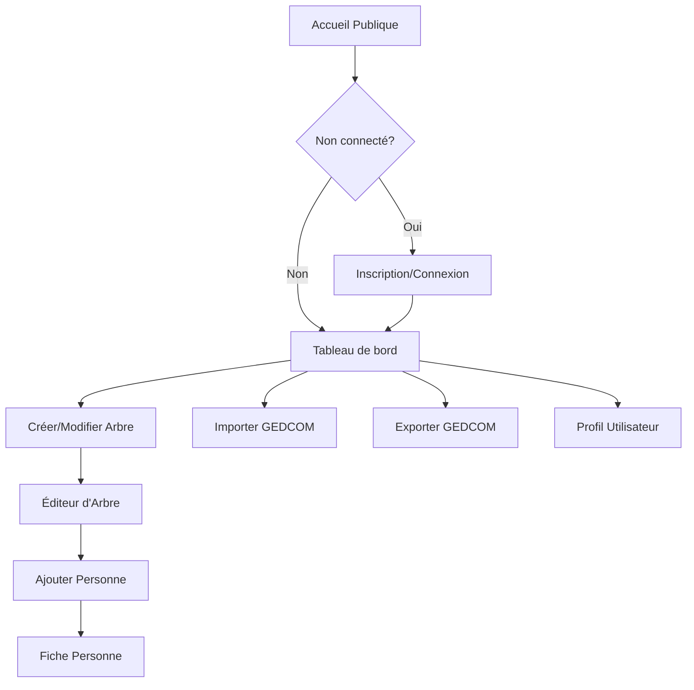

## 1. Vue d'ensemble du produit

Application web de généalogie permettant aux utilisateurs de créer, gérer et partager leur arbre généalogique. L'application offre une compatibilité complète avec le format GEDCOM standard pour l'import/export des données généalogiques.

**Objectif principal** : Centraliser la gestion des données familiales et faciliter la recherche généalogique avec un outil moderne et accessible.

**Marché cible** : Passionnés de généalogie, familles souhaitant préserver leur histoire, chercheurs en histoire familiale.

## 2. Fonctionnalités principales

### 2.1 Rôles utilisateur

| Rôle | Méthode d'inscription | Permissions principales |
|------|---------------------|------------------------|
| Utilisateur gratuit | Email + mot de passe | Créer un arbre, ajouter 50 personnes max, export GEDCOM |
| Utilisateur premium | Paiement mensuel/annuel | Arbre illimité, import GEDCOM, partage d'arbre, support prioritaire |
| Administrateur | Créé par le système | Gestion des utilisateurs, modération, statistiques globales |

### 2.2 Modules fonctionnels

L'application de généalogie comprend les pages suivantes :

1. **Page d'accueil publique** : Présentation de l'application, fonctionnalités clés, tarifs, boutons d'inscription/connexion
2. **Page d'inscription** : Formulaire de création de compte avec email, mot de passe, nom/prénom
3. **Page de connexion** : Authentification email/mot de passe avec lien de récupération
4. **Tableau de bord** : Vue d'ensemble de ses arbres généalogiques, statistiques rapides
5. **Éditeur d'arbre** : Interface graphique pour créer/modifier l'arbre généalogique avec drag & drop
6. **Fiche personne** : Détails d'une personne (nom, dates, lieux, photos, documents)
7. **Import GEDCOM** : Upload et traitement de fichiers GEDCOM (.ged)
8. **Export GEDCOM** : Téléchargement de l'arbre au format GEDCOM standard
9. **Profil utilisateur** : Paramètres personnels, gestion de l'abonnement

### 2.3 Détail des pages

| Page | Module | Description fonctionnelle |
|------|--------|---------------------------|
| Accueil publique | Hero section | Présentation visuelle de l'application avec image d'arbre généalogique |
| Accueil publique | Fonctionnalités | Cards présentant l'éditeur, l'import/export GEDCOM, le partage |
| Accueil publique | Pricing | Tableau comparatif des offres gratuit/premium avec CTA |
| Inscription | Formulaire | Champs email, mot de passe, confirmation, nom/prénom, validation email |
| Connexion | Formulaire | Email, mot de passe, case "se souvenir de moi", lien mot de passe oublié |
| Tableau de bord | Mes arbres | Liste des arbres créés avec aperçu miniature, date de modification |
| Tableau de bord | Statistiques | Nombre de personnes, générations, documents uploadés |
| Éditeur d'arbre | Vue arbre | Affichage graphique de l'arbre avec zoom, déplacement, mini-carte |
| Éditeur d'arbre | Ajout personne | Formulaire modal pour ajouter une personne avec ses informations |
| Éditeur d'arbre | Relations | Création de liens parent-enfant, mariage, fratrie par drag & drop |
| Fiche personne | Informations | Nom complet, dates naissance/décès, lieux, profession, notes |
| Fiche personne | Médias | Upload photos/documents, galerie avec visionneuse |
| Import GEDCOM | Upload | Sélection fichier .ged, progression du traitement, rapport d'import |
| Export GEDCOM | Configuration | Choix des personnes à exporter, génération fichier, téléchargement |
| Profil | Paramètres | Modification email, mot de passe, suppression compte |
| Profil | Abonnement | Vue statut actuel, historique paiements, upgrade/downgrade |

## 3. Processus principaux

### Flux utilisateur standard
1. Visiteur arrive sur l'accueil → clique sur "S'inscrire" → remplit le formulaire → valide l'email → accède au tableau de bord
2. Utilisateur connecté → crée un nouvel arbre → ajoute des personnes dans l'éditeur → établit les relations → sauvegarde automatique
3. Utilisateur premium → clique sur "Importer GEDCOM" → sélectionne un fichier → visualise le rapport → valide l'import → retravaille l'arbre
4. Utilisateur → clique sur "Exporter GEDCOM" → choisit les options → télécharge le fichier .ged

### Flux administrateur
Administrateur → accède au panel admin → visualise les statistiques → modère les contenus signalés → gère les utilisateurs

## 4. Interface utilisateur

### 4.1 Style de design

**Couleurs principales** :
- Primaire : #2E7D32 (vert forêt - symbolise la nature, la croissance)
- Secondaire : #8D6E63 (marron terre - évoque les racines familiales)
- Accent : #FFC107 (or - touche d'élégance, prestige)

**Style des boutons** : Coins arrondis (border-radius: 8px), ombres subtiles, effet hover avec transition

**Typographie** : 
- Headers : Georgia (police avec empattements pour l'aspect traditionnel)
- Corps : Roboto (lisibilité moderne)
- Tailles : 16px base, 24px h2, 32px h1

**Layout** : Design card-based pour les contenus, navigation top-bar fixe, sidebar pour l'éditeur

**Icônes** : Style outlined (contour) avec Material Design Icons

### 4.2 Vue d'ensemble des pages

| Page | Module | Éléments UI |
|------|--------|-------------|
| Accueil | Hero | Image fullscreen d'arbre généalogique ancien, overlay sombre, titre en blanc, CTA principal vert |
| Accueil | Fonctionnalités | Cards 3x2 grid avec icônes Material, descriptions courtes, boutons "En savoir plus" |
| Tableau de bord | Mes arbres | Grid responsive 3 colonnes, cards avec miniature arbre, badge nombre personnes, menu actions |
| Éditeur | Vue arbre | Canvas central avec contrôles zoom (+/-), mini-carte en haut-droite, toolbar latérale |
| Fiche personne | Informations | Formulaire 2 colonnes, champs dates avec datepicker, textarea auto-expand pour notes |
| Import | Upload | Zone drag&drop avec indicateur progression, tableau résumé données importées |

### 4.3 Responsive design

**Approche desktop-first** avec breakpoints :
- Desktop : 1200px+ (expérience complète)
- Tablet : 768px-1199px (sidebar devient drawer)
- Mobile : <768px (navigation tab-bar, éditeur simplifié)

Optimisation tactile : boutons 44px minimum, espacement 8px, swipe sur galerie photos

### 4.4 Assets visuels

- Illustrations : Style flat design avec palette de couleurs définie
- Photos : Bordures arrondies, ombres portées subtiles
- Icônes : Material Design Icons en 24px par défaut
- Animations : Transitions CSS 0.3s ease-in-out, chargement avec spinner Material