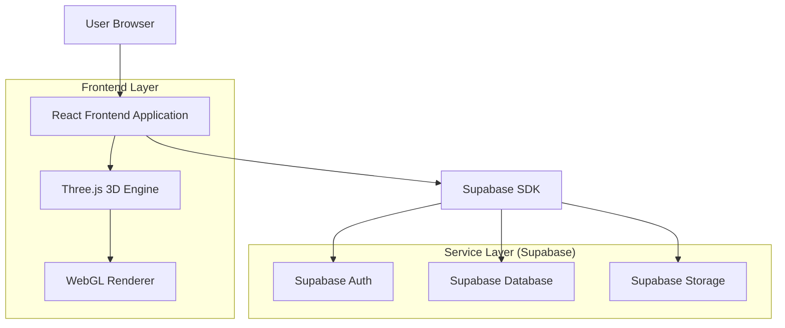
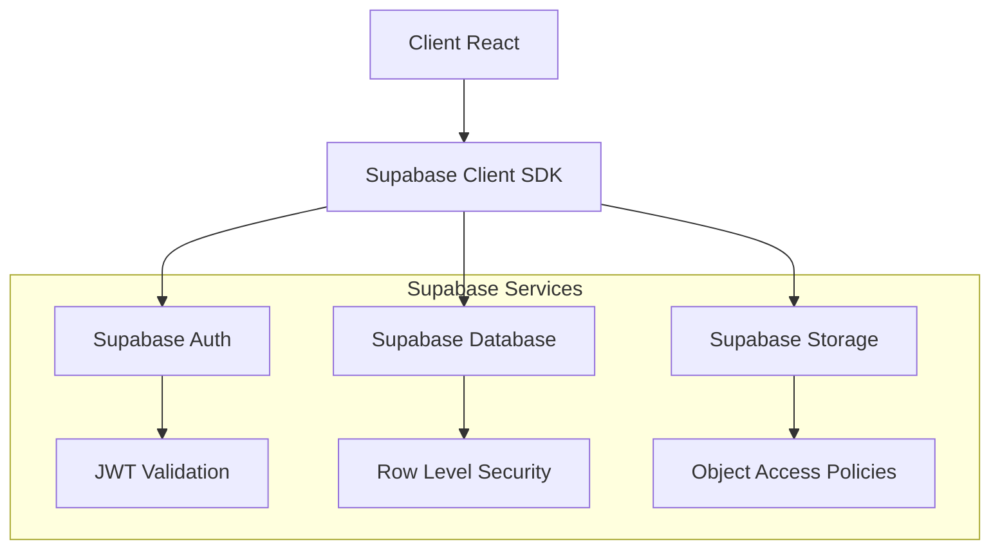
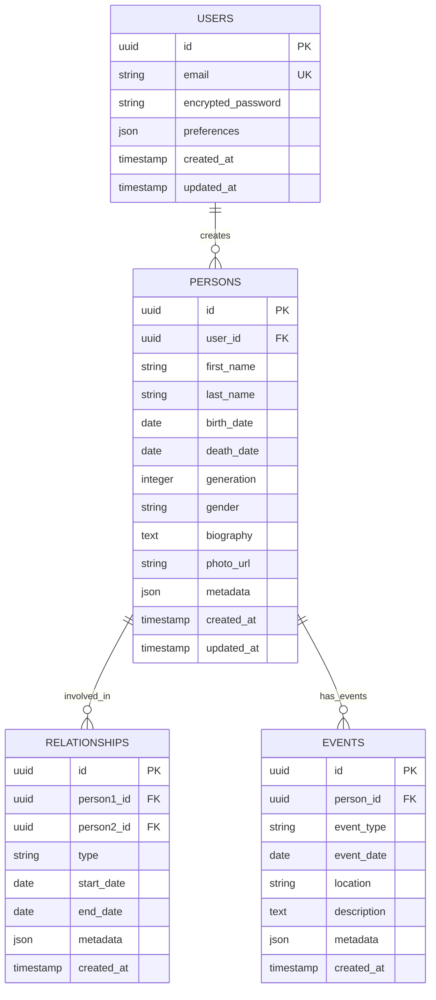

## 1. Architecture design



## 2. Technology Description

- **Frontend**: React@18 + TypeScript + Vite
- **Styling**: TailwindCSS@3 + CSS Modules pour les composants 3D
- **3D Engine**: Three.js + @react-three/fiber + @react-three/drei
- **Data Visualization**: D3.js pour les visualisations 2D complexes
- **State Management**: React Context + Zustand pour l'état local
- **Backend**: Supabase (BaaS intégré)
- **Database**: PostgreSQL via Supabase
- **Authentication**: Supabase Auth
- **Outil d'initialisation**: vite-init

## 3. Route definitions

| Route | Purpose |
|-------|---------|
| / | Page d'accueil avec sélecteur de visualisation |
| /wheel-ancestors | Roue d'ascendants avec contrôles de génération |
| /wheel-family | Roue familiale centrée sur une personne |
| /tree-artistic | Arbre artistique avec sélecteur de modèles |
| /timeline | Frise temporelle des événements familiaux |
| /profile | Gestion du profil utilisateur et préférences |

## 4. API definitions

### 4.1 Core API

**Récupération des données généalogiques**
```
GET /api/family-data/:userId
```

Request:
| Param Name | Param Type | isRequired | Description |
|------------|------------|------------|-------------|
| userId | string | true | ID de l'utilisateur |
| generations | number | false | Nombre de générations (max 10) |

Response:
| Param Name | Param Type | Description |
|------------|------------|-------------|
| persons | array | Tableau des personnes avec relations |
| relationships | array | Relations familiales (parenté, mariage) |
| maxGenerations | number | Nombre maximum de générations disponibles |

### 4.2 Types TypeScript

```typescript
interface Person {
  id: string;
  firstName: string;
  lastName: string;
  birthDate?: string;
  deathDate?: string;
  generation: number;
  parent1Id?: string;
  parent2Id?: string;
  spouseIds: string[];
  photoUrl?: string;
}

interface FamilyRelationship {
  id: string;
  person1Id: string;
  person2Id: string;
  type: 'parent-child' | 'spouse';
}

interface VisualizationSettings {
  type: 'wheel-ancestors' | 'wheel-family' | 'tree-artistic' | 'timeline';
  generations: number;
  artisticModel?: 'classic' | 'modern' | 'abstract';
  showDates: boolean;
  showPhotos: boolean;
}
```

## 5. Server architecture diagram



## 6. Data model

### 6.1 Data model definition



### 6.2 Data Definition Language

**Table des utilisateurs**
```sql
CREATE TABLE users (
    id UUID PRIMARY KEY DEFAULT gen_random_uuid(),
    email VARCHAR(255) UNIQUE NOT NULL,
    encrypted_password VARCHAR(255) NOT NULL,
    preferences JSONB DEFAULT '{}',
    created_at TIMESTAMP WITH TIME ZONE DEFAULT NOW(),
    updated_at TIMESTAMP WITH TIME ZONE DEFAULT NOW()
);

-- Index pour la performance
CREATE INDEX idx_users_email ON users(email);
```

**Table des personnes**
```sql
CREATE TABLE persons (
    id UUID PRIMARY KEY DEFAULT gen_random_uuid(),
    user_id UUID NOT NULL REFERENCES users(id) ON DELETE CASCADE,
    first_name VARCHAR(100) NOT NULL,
    last_name VARCHAR(100) NOT NULL,
    birth_date DATE,
    death_date DATE,
    generation INTEGER DEFAULT 0,
    gender VARCHAR(10) CHECK (gender IN ('male', 'female', 'other')),
    biography TEXT,
    photo_url TEXT,
    metadata JSONB DEFAULT '{}',
    created_at TIMESTAMP WITH TIME ZONE DEFAULT NOW(),
    updated_at TIMESTAMP WITH TIME ZONE DEFAULT NOW()
);

-- Index pour les requêtes fréquentes
CREATE INDEX idx_persons_user_id ON persons(user_id);
CREATE INDEX idx_persons_generation ON persons(generation);
CREATE INDEX idx_persons_names ON persons(last_name, first_name);
```

**Table des relations**
```sql
CREATE TABLE relationships (
    id UUID PRIMARY KEY DEFAULT gen_random_uuid(),
    person1_id UUID NOT NULL REFERENCES persons(id) ON DELETE CASCADE,
    person2_id UUID NOT NULL REFERENCES persons(id) ON DELETE CASCADE,
    type VARCHAR(20) NOT NULL CHECK (type IN ('parent-child', 'spouse')),
    start_date DATE,
    end_date DATE,
    metadata JSONB DEFAULT '{}',
    created_at TIMESTAMP WITH TIME ZONE DEFAULT NOW(),
    UNIQUE(person1_id, person2_id, type)
);

-- Index pour les jointures
CREATE INDEX idx_relationships_person1 ON relationships(person1_id);
CREATE INDEX idx_relationships_person2 ON relationships(person2_id);
CREATE INDEX idx_relationships_type ON relationships(type);
```

**Politiques de sécurité Supabase**
```sql
-- Accès aux données personnelles
ALTER TABLE persons ENABLE ROW LEVEL SECURITY;
CREATE POLICY "Users can view their own persons" ON persons
    FOR SELECT USING (auth.uid() = user_id);
CREATE POLICY "Users can modify their own persons" ON persons
    FOR ALL USING (auth.uid() = user_id);

-- Accès aux relations
ALTER TABLE relationships ENABLE ROW LEVEL SECURITY;
CREATE POLICY "Users can view relationships for their persons" ON relationships
    FOR SELECT USING (
        EXISTS (
            SELECT 1 FROM persons 
            WHERE persons.id = relationships.person1_id 
            AND persons.user_id = auth.uid()
        )
    );
```

### 6.3 Configuration Three.js

**Configuration du renderer 3D**
```typescript
const canvasConfig = {
  antialias: true,
  alpha: true,
  powerPreference: 'high-performance'
};

const sceneConfig = {
  background: new Color(0xfafafa),
  fog: new Fog(0xfafafa, 10, 50)
};

const cameraConfig = {
  fov: 75,
  near: 0.1,
  far: 1000,
  position: [0, 0, 10]
};

const lightingConfig = {
  ambient: { intensity: 0.6 },
  directional: {
    intensity: 0.8,
    position: [10, 10, 5],
    castShadow: true
  }
};
```