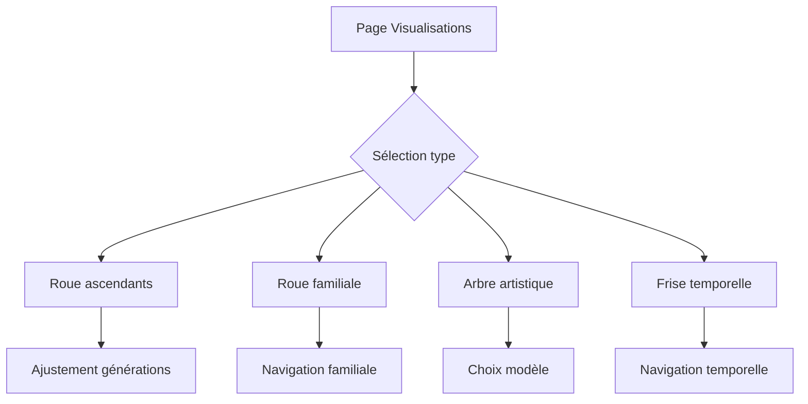

## 1. Vue d'ensemble du produit
Application de visualisation généalogique interactive permettant d'explorer les arbres familiaux à travers différentes représentations visuelles : roue d'ascendants, roue familiale, arbre artistique et frise temporelle.

L'application résout les problèmes de lisibilité et d'interaction dans les visualisations généalogiques existantes, en offrant des interfaces intuitives pour naviguer dans les données familiales complexes.

## 2. Fonctionnalités principales

### 2.1 Rôles utilisateurs
| Rôle | Méthode d'inscription | Permissions principales |
|------|----------------------|------------------------|
| Utilisateur connecté | Email/mot de passe | Accès à toutes les visualisations, modification des données familiales |
| Invité | Accès restreint | Consultation uniquement des arbres partagés |

### 2.2 Modules de fonctionnalités
L'application comprend les pages et modules suivants :

1. **Page d'accueil des visualisations** : sélecteur de type de visualisation, paramètres d'affichage
2. **Roue d'ascendants** : cercles concentriques représentant les générations, interactions au survol
3. **Roue familiale** : vue centrée sur une personne avec son cercle familial proche
4. **Arbre artistique** : représentation stylisée avec modèles de rendu personnalisables
5. **Frise temporelle** : ligne du temps avec événements familiaux

### 2.3 Détails des pages
| Page | Module | Description fonctionnelle |
|------|---------|--------------------------|
| Roue d'ascendants | Affichage généalogique | Afficher les ancêtres en cercles concentriques avec connexions familiales |
| Roue d'ascendants | Sélecteur de générations | Permettre le choix du nombre de générations à afficher (1-10 générations) |
| Roue d'ascendants | Infobulle survol | Afficher nom complet, dates de naissance/décès au survol d'une personne |
| Roue d'ascendants | Gestion des espaces | Ne montrer les espaces vides que pour les personnes non enregistrées |
| Roue familiale | Centre de la roue | Afficher la personne sélectionnée au centre |
| Roue familiale | Cercle familial | Montrer conjoint, enfants, parents et frères/soeurs |
| Arbre artistique | Sélecteur de modèles | Permettre le choix entre 3-5 modèles de représentation (classique, moderne, abstrait) |
| Arbre artistique | Affichage des données | Superposer les informations personnelles sur la représentation visuelle |
| Frise temporelle | Axe temporel | Afficher les événements sur une ligne du temps horizontale |
| Frise temporelle | Étiquettes de dates | Positionner les dates en dessous de l'axe pour éviter les chevauchements |
| Frise temporelle | Informations personnes | Afficher nom, prénom, naissance et décès pour chaque personne |
| Frise temporelle | Sélecteur de type | Implémenter un menu déroulant automatique au survol |

## 3. Processus principaux

### Flux utilisateur général
1. L'utilisateur accède à la page des visualisations
2. Il sélectionne le type de visualisation souhaitée
3. Il ajuste les paramètres (nombre de générations, modèle de rendu)
4. Il navigue dans la visualisation avec les interactions au survol
5. Il peut exporter ou partager la visualisation

## 4. Interface utilisateur

### 4.1 Style de design
- **Couleurs principales** : Bleu royal (#4169E1) pour les éléments principaux, blanc cassé (#FAFAFA) pour l'arrière-plan
- **Couleurs secondaires** : Gris clair (#E0E0E0) pour les bordures, vert sapin (#228B22) pour les éléments validés
- **Boutons** : Style arrondi avec ombre portée légère, effet de survol subtil
- **Typographie** : Police system-ui, taille 14px pour le texte, 18px pour les titres
- **Icônes** : Style minimaliste avec stroke de 2px, utilisation d'emojis pour les indications visuelles

### 4.2 Vue d'ensemble des pages
| Page | Module | Éléments UI |
|------|---------|-------------|
| Roue d'ascendants | Cercles généalogiques | Cercles concentriques colorés, lignes de connexion, infobulles au survol |
| Roue d'ascendants | Contrôles | Sélecteur déroulant pour générations, bouton de réinitialisation |
| Roue familiale | Centre personne | Cercle central surligné, photo de profil optionnelle |
| Roue familiale | Entourage familial | Petits cercles autour avec noms abrégés |
| Arbre artistique | Canvas 3D | Rendu WebGL avec modèles stylisés, contrôles de rotation |
| Arbre artistique | Sélecteur de style | Boutons radio avec aperçu miniature |
| Frise temporelle | Axe horizontal | Ligne principale avec graduations, points pour les événements |
| Frise temporelle | Panneau latéral | Liste déroulante au survol avec options de filtre |

### 4.3 Responsive design
Approche desktop-first avec adaptation mobile :
- Desktop : Affichage complet avec tous les contrôles latéraux
- Tablette : Contrôles compacts en haut, visualisation principale ajustée
- Mobile : Mode plein écran pour la visualisation, menu burger pour les options

### 4.4 Interactions spécifiques
- **Survol souris** : Apparition d'infobulles avec informations complètes après 500ms
- **Clic maintem** : Possibilité de faire glisser la visualisation (rotation pour les roues, défilement pour la frise)
- **Zoom** : Molette de souris pour zoomer/dézoomer sur toutes les visualisations
- **Touch mobile** : Gestes pincer pour zoomer, glisser pour naviguer